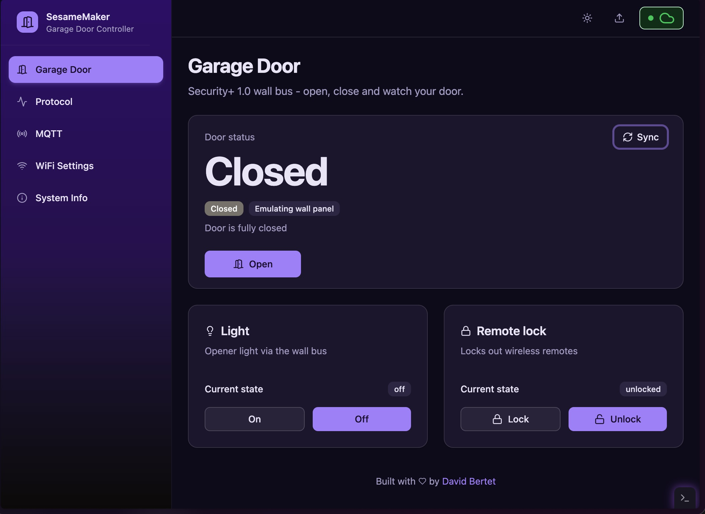

# SesameMaker: ESP32 Garage Door Controller

<div align="center">
  
  
  
</div><br/>

SesameMaker is an ESP32-based garage door controller for LiftMaster/Chamberlain openers (Security+ 1.0 / 2.0 wall-bus) and dry-contact openers. It provides real-time door state, light and lock control, with native MQTT, HomeKit, and Zigbee (ESP32-C6) integration for Home Assistant and smart-home hubs.

## 🏠 Will it work with my garage door?

Look at the **learn button** on your opener motor (under the light cover):

- **Yellow, purple, red, green, or orange button → good**, SesameMaker connects straight to the opener's 2 wires.
- **White button (Security+ 3.0) → not directly compatible** — only via the spare-remote solder hack (see Wiring).
- **Any other brand with a simple wall button → usually works** in dry-contact relay mode.

## ✨ Features

- **Works with**: MQTT, HomeKit, and Zigbee (ESP32-C6) for home-assistant / hub integration
- **Door control & state**: open / close / stop / toggle, with open / closed / opening / closing / stopped
- **Light & lock**: opener light on/off, lock out wireless remotes
- **Obstruction**: photo-eye obstruction events
- **Wall panel aware**: snoops the bus when a real wall panel is present; auto-emulates one if missing
- **Left-open escalation**: warn if the door stays open, optionally auto-close, blink the opener light
- **NTFY notifications**: door opened/closed/left-open alerts via the webhook API
- **Seamless, secure updates**: one-click install and update from the browser; release signed and verified on-device, uploads gated by a per-device OTA password
- **Protocol inspector**: live RX/TX byte log with decoded meaning — verify wiring from the browser

Try the [live sample](https://davidbertet.github.io/SesameMaker/) to see the UI and installer in action.

[](https://davidbertet.github.io/SesameMaker/)

## 🔌 Wiring

The wall bus is **not** 3.3 V logic - never connect an ESP32 GPIO to it directly.

**Security+ 1.0 / Security+ 2.0** (same 2-wire wall-control terminals; pick the protocol in settings):

- **TX** (GPIO4): open-collector driver (NPN transistor or optocoupler) that pulls the wall line low; GPIO4 → base through ~1 kΩ
- **RX** (GPIO16): voltage divider scaling the wall line down to ≤ 3.3 V into GPIO16 (measure your line voltage first - these are typically in the 5–24 V range)
- Connect to the same two terminals as your existing wall button (leave the button connected - the bus is shared)
- Security+ 2.0 uses 9600 baud 8N1 with a break pulse before each TX frame; the same opto-isolated TX/RX hardware works

> **Not compatible:** Security+ 3.0 openers (white learn button) have no native bus support. Workaround is a dry-contact relay soldered across the button contacts of a spare remote — unofficial hack with no bus feedback (door state via reed sensors only).

**Dry-contact relay** (openers without a data bus, or Security+ 3.0 via the spare-remote hack):

- Relay NO/COM across the opener's wall-button terminals; driven by GPIO5 (active pulse ~500 ms per press)
- Optional reed limit sensors: open limit → GPIO17, close limit → GPIO18, other side to GND (default assumes sensors pull low when hit; configurable)
- No TX/RX bus wiring needed; door position comes from the reed sensors instead of bus feedback

## 🚀 Get Started

### Option A: Install prebuilt binaries from the webpage (recommended)

No coding needed — plug the device into a laptop, click Install, enter your Wi-Fi credentials.

1. Open the [web installer](https://davidbertet.github.io/SesameMaker/?tab=setup) in a Chromium browser (Chrome/Edge).
2. Connect your ESP32 (C3, C6, or S3) over USB.
3. In **Install firmware**, pick your chip variant and release tag, optionally enable **Erase all**, then click install and pick the serial port.
4. After flashing, the page keeps the port: connect, read the firmware/chip info, reveal the one-time OTA password, and form to set WiFi credentials.
5. Once connected, access device URL to use the UI: **Garage Door** tab controls the door/light/lock, **Protocol** shows live bus traffic.

### Option B: Build and install locally (for custom boards)

1. **Install on your ESP32** (builds the frontend + backend, flashes over USB, then provisions WiFi over USB)

   ```shell
   ./install.sh
   ```

2. **Update over the air**

Same command, pick the device in the list using it's IP address

```shell
./install.sh
```

3. **Verify**: once connected, open the device URL. The **Protocol** tab shows live bus traffic; the **Garage Door** tab gives you door/light/lock controls.

## ❓ FAQ — door doesn't move?

- **Right protocol selected?** In the **Garage Door** tab, check the protocol matches your opener: yellow learn button → Security+ 2.0, purple/red/green/orange → Security+ 1.0, anything else → dry-contact. Wrong pick = silent door.
- **Wiring?** Bus models share the 2 wall-button terminals (keep the wall button connected). Check TX/RX aren't swapped, and the **Protocol** tab shows live traffic when you press the wall button — no traffic = wiring issue.
- **Dry-contact state wrong?** Door position comes from the reed sensors (GPIO17/18, pull low when hit). Check magnet alignment and that open/close limits aren't swapped.
- **Lost Wi-Fi?** If it can't join your home Wi-Fi, on reboot it broadcasts a `SesameMaker` setup hotspot for ~2 min (password `StopNow!`). Join it and access http://192.168.4.1 to re-enter credentials. Missed it? Reboot to bring it back.
- **Forgot the OTA password?** It's shown once during USB flash — save it. Required for file OTA updates in the web UI. Lost it? Reconnect over USB — the [web installer](https://davidbertet.github.io/SesameMaker/?tab=setup) page can reveal it again.
- **White learn button?** No native bus support — spare-remote relay hack only, no light/lock feedback.

## 🧪 Tests

- `npm run test` - CLI unit tests (node:test), from the repo root
- `npm run test:backend` - host-side unit tests for the secplus1 protocol (decode, framing, door pursuit, panel emulation)
- `cd frontend && npm test` - helpers, status parsing, mock transitions

## 🎨 Linting

The CLI follows the repo's `.prettierrc` (no semicolons, single quotes). Format and check it with:

- `npm run format` - apply Prettier to the `cli/` code
- `npm run lint` - check that `cli/` matches Prettier style (fails CI if not)

Both the CLI lint/format and CLI tests run in CI (`lint-and-test` job) on every push to `main`.

## 🛠️ Tech Stack

- Svelte 5 + shadcn-svelte frontend
- ESP-IDF backend (PlatformIO) with static file serving
- WebSocket interface for real-time status
- Web installer + browser UI over WebSerial/WebSocket
- OTA firmware updates with manifest signature verification and automatic rollback
- MQTT / HomeKit / Zigbee (ESP32-C6)

## 📁 Folder Architecture

```
SesameMaker/
├── frontend/    # Svelte web application
├── backend/     # ESP-IDF backend code
├── cli/         # CLI tool for install/update
├── tools/       # Release/signing/dev helpers
└── assets/      # Images and media for docs
```

## 💡 Inspiration & Disclaimer

SesameMaker aims to provide a polished, reliable, and interoperable garage door controller with first-class Zigbee support — easy to install, easy to integrate, and easy to trust for daily use.

It builds on prior open-source work, notably [ratgdo](https://github.com/ratgdo/esphome-ratgdo) for Security+ 1.0 wall-bus research, the [ESPHome](https://github.com/esphome/esphome) / [Improv Wi-Fi](https://github.com/improv-wifi) ecosystem for the USB provisioning security model, and browser flashing via [esptool-js](https://github.com/espressif/esptool-js) / [ESP Web Tools](https://github.com/esphome/esp-web-tools). This firmware is an independent ESP-IDF implementation and is not affiliated with or endorsed by LiftMaster, Chamberlain, ratgdo, ESPHome, or Espressif.

**Safety notice:** garage doors are heavy moving machinery that can cause serious injury. Install and operate at your own risk, keep photo-eye safety sensors connected and tested, and always follow your opener manufacturer's safety instructions.

## 📝 License

This project is licensed under the MIT License.
